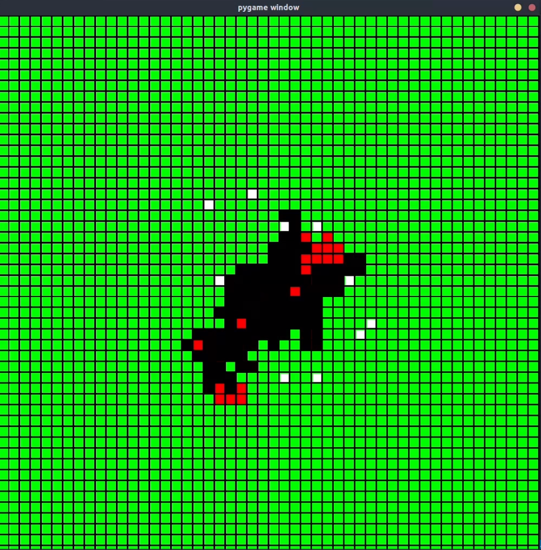

# Forest Fire Multiagent AI Drone System

This project focuses on creating a forest firefighting system using a multiagent AI drone model. The system leverages reinforcement learning, specifically Deep Q-Learning, to efficiently address forest fires.

## Problem: Forest Fires

Forest fires cause extensive damage to ecosystems and human settlements. Traditional firefighting methods are often inadequate due to the scale and rapid spread of fires. This project aims to address these challenges by deploying a team of UAVs to autonomously detect and extinguish fires using advanced AI techniques.

## Deep Q-Learning Technique

Deep Q-Learning is a reinforcement learning algorithm that combines Q-Learning with deep neural networks. It enables agents to learn and make decisions in complex environments by approximating the Q-value function, which estimates the expected reward of taking a given action in a particular state.

### Application in This Project

We use Deep Q-Learning to train a team of UAVs to autonomously navigate and extinguish forest fires. The UAVs receive state information from the environment, such as fire locations and their own positions, and use this information to decide the best actions to take. Actions include moving in different directions and deploying firefighting measures.

### Forest Model

The forest environment is modeled as a grid where each cell represents a part of the forest. Trees can be in one of three states: healthy, burning, or burnt. The UAVs navigate this grid to identify and extinguish fires while minimizing damage to healthy trees.

## Demonstration

### Images



### Video
[Watch Video](https://www.canva.com/design/DAGNEaLSG9w/Ckwk1tqNIGR4eoN9lx-BkA/watch?utm_content=DAGNEaLSG9w&utm_campaign=designshare&utm_medium=link&utm_source=editor)

## How to Use

We have provided a pre-trained model for testing. Download the model from the following [link](https://drive.google.com/file/d/16JNYKtwzH1OVax_4DNv1zHg-heTGU_u1/view?usp=sharing). Alternatively, you can train the model yourself.

### Training the Model

Follow these steps to train the model:

1. Initialize the model in training mode:
    ```python
    model = MODEL(mode="train")
    ```

2. Train the model by running the `train` method:
    ```python
    metrics = model.train(num_episodes=1000)
    ```

   This will train the model for 1000 episodes. You can adjust the number of episodes as needed.

3. Save the trained model:
    ```python
    model.save_checkpoint()
    ```

### Testing the Model

To test the trained model, follow these steps:

1. Initialize the model in test mode and load the trained model:
    ```python
    model = MODEL(mode="test", filename="path_to_trained_model.pth.tar")
    ```

2. Test the model by running the `test` method:
    ```python
    metrics = model.test(num_episodes=100, num_agents=10)
    ```

   This will test the model for 100 episodes with 10 agents. You can adjust the parameters as needed.

3. Analyze the results:
   The `test` method returns metrics that you can analyze to evaluate the model's performance.

## Python Requirements

Ensure you have the following Python libraries installed:

- PyTorch
- NumPy
- PyGame
- Matplotlib

You can install these dependencies using `pip`:

```bash
pip install torch numpy pygame matplotlib
